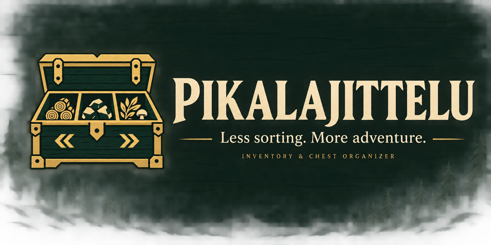
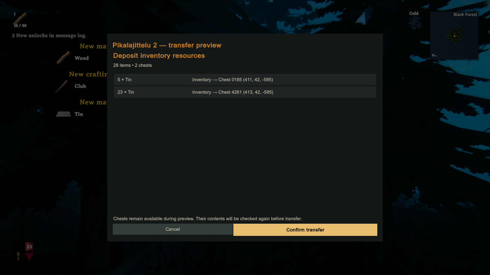

# Pikalajittelu

An inventory and chest organizer for **Valheim**. Preview a deposit, bring matching
items together across nearby chests, and find what you stored without opening
every chest. Finnish and English interface.

**[Download 2.0.1-rc1](https://github.com/MikkoNurminenn/Pikalajittelu/releases/tag/v2.0.1-rc1)** ·
**[Suomenkielinen ohje](LUEMINUT.md)** · **[Validation and limitations](TESTIT.md)**

**[Buy me a coffee](https://ko-fi.com/ravimies)** — support is optional; the complete mod stays free for everyone.

> **Release candidate, not a verified stable release.** Local multiplayer
> disconnect tests passed. Real two-machine Steam/crossplay sessions and the full
> mouse/keyboard input path are still unverified. Start with a test world and
> retain your normal character/world backups.

## Three shortcuts

| Shortcut | Action |
| --- | --- |
| **P** | Preview depositing inventory resources into nearby chests. |
| **Left Shift + P** | Preview reorganizing items between nearby chests. |
| **Left Alt + P** | Open search, chest rules, settings and history. |

Close other game menus before using a shortcut. Keys can be changed in Settings.
The default range is 10 metres, adjustable from 1 to 20 metres.
While a mod window is open, gameplay movement, attacks, mouse-look and game
shortcuts are blocked. Text fields, buttons, key capture and Escape remain
available to the mod interface. The closing event is consumed before gameplay resumes.

## What it does

- **Preview before moving.** See quantities, source and destination. Chests are
  released while you review; confirmation reserves them again and checks the plan.
- **Keep essentials.** Hotbar items, equipment, tools, weapons, food, ammunition
  and quest items stay in your inventory by default. Add exclusions and minimum
  quantities such as `Wood=20`.
- **Organize the whole nearby store.** Prefer the chest already holding the most
  of an item, merge compatible stacks and plan swaps between full chests.
- **Name and control chests.** Allow categories or specific items, or exclude a
  chest from your sorting. Rules belong to the current character and world.
- **Find items.** Search the observed contents of loaded, accessible chests.
- **Conditional undo and history.** Undo the last transfer in the current session
  only while all original inventories remain exactly unchanged and accessible.

Item identity includes metadata rather than just name and quality. Transfers
write before/after snapshots, verify inventory and network state, and attempt
rollback on failure. These checks reduce risks; they are not a guarantee against
all mod interactions, crashes or save failures.



## Install on Windows / Steam

1. Download the release ZIP and extract the **whole folder**. GitHub's automatic
   “Source code” ZIP is for development and does not contain the compiled plugin.
2. Close Valheim and any local Valheim server.
3. Run `Asenna.cmd` from the extracted release folder.
4. Start Valheim normally through Steam and press **P** near your chests.

The installer checks the plugin's SHA256, rejects duplicate installations and
backs up an existing DLL before replacement. It preserves an existing BepInEx 5
installation. If no loader exists, it downloads the pinned, checksum-verified
BepInExPack Valheim 5.4.2350. It refuses to overwrite another/partial loader.

For a different Steam library:

```powershell
./Asenna.ps1 -GamePath 'D:\SteamLibrary\steamapps\common\Valheim'
```

Add `-ValidateOnly` to check the package and path without installing. To uninstall,
close the game and remove only `BepInEx/plugins/Pikalajittelu`.

## Multiplayer and compatibility

Built and tested against **Valheim 1.0.15**, Unity 6000.0.75f1 and BepInEx 5.
The mod runs for the player who installs it. Installing it on the host does not
give the other players sorting hotkeys. Native chest ownership and permissions
are respected; open or inaccessible chests are skipped.

Two local game processes exercised native ownership transfers, both sorting
directions, a peer with its sorter disabled, late/duplicate responses and socket
disconnects. This is **not** a Steam/crossplay transport certification.

The old opt-in grave recovery feature is separate, off by default and excluded
from this release's validation. Keep it disabled in this release candidate.

Mods or developer commands can affect achievements. See the
[official Valheim hotfix guidance](https://www.valheimgame.com/news/hotfix-1-0-10-1-0-12/).
Pikalajittelu does not change the achievement opt-in automatically.

## Develop and report problems

```powershell
./Test.ps1
./Build.ps1 -GamePath 'C:\Program Files (x86)\Steam\steamapps\common\Valheim'
```

Pure logic tests do not need game binaries. Building the plugin requires your own
Valheim installation and BepInEx 5. No game, Unity or BepInEx libraries are included.
See [development](docs/DEVELOPMENT.md) for isolated runtime tests and packaging.

If a transfer fails, stop repeating it and retain the transaction directory from
`BepInEx/config/Pikalajittelu/transactions`. Report the mod/game version and the
small relevant error excerpt; redact player names, paths and account identifiers.

[Brand assets and usage](assets/brand/BRAND.md) · [Changelog](CHANGELOG.md)

Unofficial community mod; not affiliated with Iron Gate. Screenshots show the
actual test game. Brand artwork was generated with OpenAI Imagegen.
